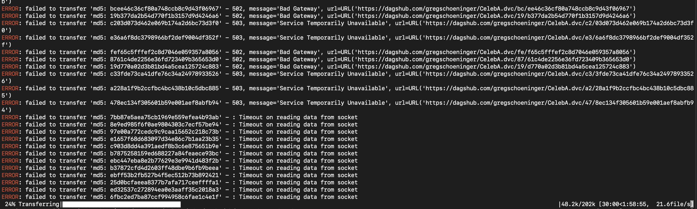

# Performance Numbers

## CelebA Dataset

The CelebA dataset has 202,599 images of celebrity faces and their attributes.

~ TLDR ~

* ✅ Oxen syncs all the images in under 6 minutes
* 👎 aws s3 cp takes almost 40 minutes to sync all 200k images
* 😩 DVC+Dags Hub took over 2 hours and 40 minutes with intermittent failures
* 🐢 git+git lfs syncing GitHub took over 4 hours

<p align="center">
    
</p>

# 🐂 Oxen

```
oxen add images # ~10 sec
oxen commit -m "adding images # ~41 sec
oxen push origin main # ~308.98 secs
```

Total time or <6 min to sync to Oxen.

# aws s3 cp

You may currently be storing your training data in AWS s3 buckets. Even this is slower than syncing to Oxen. Not to mention it lacks other features you gain with Oxen.

The AWS S3 tool syncs each image sequentially and takes about 38 minutes to complete. Oxen optimizes the file transfer, compresses the data, and has a 5-10x performance improvement depending on your network and compute.

```
time aws s3 cp images/ s3://testing-celeba --recursive
________________________________________________________
Executed in   38.87 mins
```

# Git + Git LFS

Compare this to a system like [git lfs](https://git-lfs.github.com/) on the same dataset

```
git init
git lfs install
git lfs track "*.jpg"
git add .gitattributes
git add images # ~189 sec
git commit -m "adding images" # ~32 sec
```

Push to GitHub had a transfer speed anywhere from 80-100 kb/s

```
$ git remote add origin git@github.com:Oxen-AI/GitLFS-CelebA.git
$ git push origin main # ~264 mins

Uploading LFS objects: 100% (202468/202468), 1.4 GB | 99 KB/s, done.
________________________________________________________
Executed in  264.55 mins    fish           external

```

Total time: ~4.4 hours

# DVC + DagsHub

DVC is built on top of git + an open source project and can be synced to a hub called DagsHub.

```
dvc init
dvc add images/ # ~460.13 secs
dvc push -r origin # ~160.95 mins
```

~2 hours 40 minutes with intermittent failures




# DVC Workflow - Food 101

```
git init
dvc init
dvc add images/ # Executed in  249.16 secs
git add images.dvc .gitignore
git commit -m "adding images"
git remote add origin https://github.com/owner/repository.git
dvc remote add --default datastore s3://my-bucket
git push origin main
dvc push # Executed in  719.79 secs
```

Total: 968.95 = 16 min

# Oxen.ai Workflow Food 101

```
oxen init
oxen add images # Executed in   12.90 secs
oxen commit -m "adding images" # Executed in   34.77 secs
oxen push # Executed in  150.22 secs
```

Total: 3.8 mins


# Git LFS - Food 101

```
git init
git lfs install
git lfs track "*.jpg"
git add .gitattributes
git add images # Executed in  132.82 secs
git commit -m "adding images"
git push origin main # 79.96 min
```

Total: 82+ min