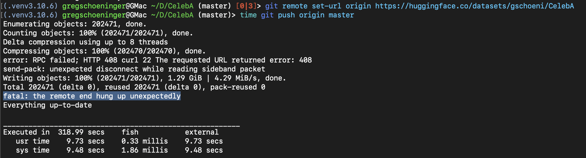

# Performance Numbers

## CelebA Dataset

The CelebA dataset has 202,599 images of celebrity faces and their attributes. 

~ TLDR ~

* ✅ Oxen syncs all the images in under 6 minutes
* 👎 aws s3 cp takes almost 40 minutes to sync all 200k images
* ⛔️ git+git lfs failed to sync to hugging face, took 9 minutes before a `fatal: the remote end hung up unexpectedly` error
* 😩 DVC+Dags Hub took over 2 hours and 40 minutes with intermittent failures

# 🐂 Oxen

```
oxen add images # ~10 sec
oxen commit -m "adding images # ~41 sec
oxen push origin main # ~308.98 secs
```

Total time or <6 min to sync to Oxen.

# aws s3 cp

You may currently be storing your training data in AWS s3 buckets. Even this is slower than syncing to Oxen. Not to mention it lacks other features you gain with Oxen.

The AWS S3 tool syncs each image sequentially and takes about 38 minutes to complete. Oxen optimizes the file transfer, compresses the data, and has a 5-10x performance improvement depending on your network and compute.

```
time aws s3 cp images/ s3://testing-celeba --recursive
________________________________________________________
Executed in   38.87 mins
```

# Git + Git LFS

Compare this to a system like [git lfs](https://git-lfs.github.com/) on the same dataset

```
git lfs track images # ~17 sec
git add images # ~136 sec
git commit -m "adding images" # ~44 sec
```

Then we try to push but... fatal: the remote end hung up unexpectedly

```
git remote add origin https://huggingface.co/datasets/<username>/CelebA
git push origin master # ~318 secs but failed
```



Total time: ~9 minutes until a failure, unknown time if success 🤷‍♂️


# DVC + DagsHub

DVC is built on top of git + an open source project and can be synced to a hub called DagsHub.

```
dvc init
dvc add images/ # ~460.13 secs
dvc push -r origin # ~160.95 mins
```

~2 hours 40 minutes with intermittent failures


