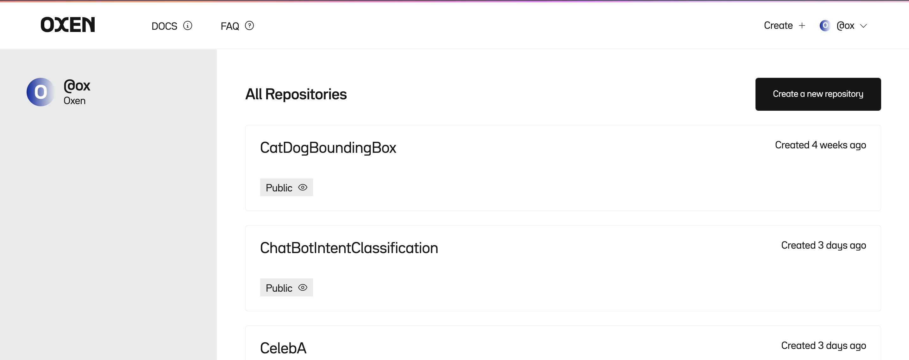
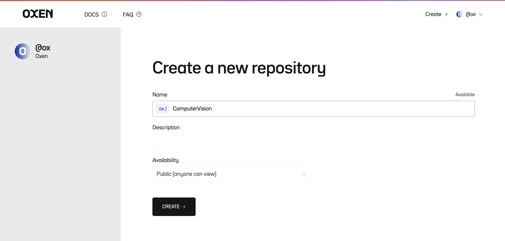

# 🐂 Oxen

Oxen helps you version on your machine learning datasets like you version your code. 

The shift to [Software 2.0](https://karpathy.medium.com/software-2-0-a64152b37c35) is happening where we are replacing lines with machine learning models and large datasets. Software is already complex, without the complexity of machine learning in the mix. We need better tooling to keep track of changes as data and models evolve over time.

Versioning datasets with `git` or `git lfs` is [slow and painful 😩](Performance.md). Git was built over 18 years ago and is optimized for code repositories, not large datasets.

Oxen 🐂 is built from the ground up for speed and can large datasets. It is 10-100x faster than using git or other tooling build on top of git.

# Features

* 🔥 Fast (10-100x faster than existing tools)
* 🧠 Easy to learn (same commands as git)
* 🗄️ Index lots files (millions of images? no problem)
* 🎥 Handles large files (images, videos, audio, text, parquet, arrow, json, models, etc)
* 📊 Native DataFrame processing ([oxen df](DataFrames.md) command for data exploration)
* 📈 Tracks changes over time (never worry about losing the state of your data)
* 🤝 Collaborate with your team (sync to an oxen-server)
* 👀 Better data visualization on [OxenHub](https://oxen.ai)

Sign up [here](https://airtable.com/shril5UTTVvKVZAFE) for more information and to stay updated on the progress.

# Why the name Oxen?

"Oxen" 🐂 comes from the fact that the tooling will plow, maintain, and version your data like a good farmer tends to their fields 🌾. Let Oxen take care of grunt work of your infrastructure so you can focus on the higher level ML problems that matter to your product.

# Overview

The Oxen Command Line Interface (CLI) mirrors [git](https://git-scm.com/) in many ways, so if you are comfortable versioning code with git, it will be straight forward to version your datasets with Oxen.

# Installation

For Mac Users

```bash
$ brew tap Oxen-AI/oxen
$ brew install oxen
```

For other platforms follow the [installation instructions](Installation.md).

# Basic Commands

Here is a quick overview of common commands translated to Oxen.

## Setup User

For your commit log, you will have to setup your local Oxen user name and email

```bash
$ oxen config --name <NAME> --email <EMAIL>
```

## Create Repository

First create a new directory, navigate into it, and perform

```bash
$ oxen init
```

## Stage Data

You can stage changes that you are interested in committing with the `oxen add` command and giving a full file path or directory.

```bash
$ oxen add images/
```

## View Status

To see what data is tracked, staged, or not yet added to the repository you can use the `status` command. 

Note: since we are dealing with large datasets with many files, `status` rolls up the changes and summarizes them for you.

```bash
$ oxen status

On branch main -> e76dd52a4fc13a6f

Directories to be committed
  added: images with added 8108 files

Files to be committed:
  new file: images/000000000042.jpg
  new file: images/000000000074.jpg
  new file: images/000000000109.jpg
  new file: images/000000000307.jpg
  new file: images/000000000309.jpg
  new file: images/000000000394.jpg
  new file: images/000000000400.jpg
  new file: images/000000000443.jpg
  new file: images/000000000490.jpg
  new file: images/000000000575.jpg
  ... and 8098 others

Untracked Directories
  (use "oxen add <dir>..." to update what will be committed)
  annotations/ (3 items)
```

You can always paginate through the changes with the `-s` (skip) and `-l` (limit) params on the status command. Run `oxen status --help` for more info.

## Commit Changes

To commit the changes that are staged with a message you can use

```bash
$ oxen commit -m "Some informative commit message"
```

## Log

You can see the history of changes on your current branch with by running.

```bash
$ oxen log

commit 6b958e268656b0c5

Author: Ox
Date:   Fri, 21 Oct 2022 16:08:39 -0700

    adding 10,000 training images

commit e76dd52a4fc13a6f

Author: Ox
Date:   Fri, 21 Oct 2022 16:05:22 -0700

    Initialized Repo 🐂
```

## Reverting To Commit

If ever you want to change your working directory to a point in your commit history, you can simply supply the commit id from your history to the `checkout` command.

```bash
$ oxen checkout COMMIT_ID
```

## Restore Working Directory

The `restore` command comes in handy if you made some changes locally and you want to revert the changes. This can be used for example if you accidentally delete or modify or stage a file that you did not intend to.

```bash
$ oxen restore path/to/file.txt
```

Restore defaults to restoring the files to the current HEAD. For more detailed options, as well as how to unstage files refer to the [restore documentation](commands/Restore.md).

## Advanced Features

Oxen has many more advanced features such as [computing diffs](#diff) between tabular data as well as convenient DataFrame manipulation through the [oxen df](DataFrames.md) command.

Feel free to skip down to the more [advanced features](#data-point-level-version-control).

# Sharing Data and Collaboration

There are two ways you can collaborate on your data with Oxen. 

1) Using the [OxenHub](https://www.oxen.ai/register) platform
2) Self hosting using the [oxen-server](#setup-an-oxen-server) binary

The easiest route is to sign up for an account on [OxenHub](https://www.oxen.ai/register) and sync your data to a repository there.

## Create an account

Visit [https://www.oxen.ai/register](https://www.oxen.ai/register) to register

## Create a data repository

From your home page you can view your repositories and create a new repository.



Pick a name and give your repository a description. Repositories can be public for anyone to view, or private just for you and your company.



## Push your data

Once you have created a repository, you will see a URL you can push your data to in the format `https://hub.oxen.ai/<username>/<repo_name>`

From your data repository that you [created above](#create-repository) you can simply add the remote and push.

```bash
$ oxen set-remote origin https://hub.oxen.ai/<username>/<repo_name>
$ oxen push origin main
```

🎉 Congrats! You should now be able to see your data in the hub.

Now you can setup your training job or another collaborator on your team to use your data by cloning it and pulling the branch you want.

```bash
$ oxen clone https://hub.oxen.ai/<username>/<repo_name>
$ cd <repo_name>
$ oxen pull origin main
```

## Self Hosting

Oxen enables self hosting with the `oxen-server` binary. You do not get any of the UI features of the hub, but this is a nice option to kick the tires or set up internal infrastructure. Some teams setup a server instance in their local network and use it simply as backup and version control, others set it up in the cloud to enable sharing across data centers.

You can read more about self hosting [here](SelfHosting.md).

# Diving Deeper

## Data Point Level Version Control

Oxen is smart about what file types you are adding. For example if you track a tabular data file (with an extension `.csv`, `.tsv`, `.parquet`, `.arrow`, `.jsonl`, or `.ndjson`) Oxen will index and keep track of each row of data.

```bash
$ oxen add annotations/train.csv
$ oxen commit -m "adding rows and rows of data"
```

Under the hood Oxen will detect the data schema and hash every row of content. This allows us to build a content addressable DataFrame to track the changes to the rows and columns over time. To learn more about the power of indexing DataFrames checkout the [data point level version control documentation](DataPointLevelVersionControl.md).

Oxen also has some [handy command line tooling](DataFrames.md) for [Exploratory Data Analysis](https://en.wikipedia.org/wiki/Exploratory_data_analysis) with DataFrames. The `oxen df` command let's you easily view, modify, slice, and modify the data.

```bash
$ oxen df annotations/train.csv

shape: (10000, 6)
┌─────────────────────────┬───────┬────────┬────────┬────────┬────────┐
│ file                    ┆ label ┆ min_x  ┆ min_y  ┆ width  ┆ height │
│ ---                     ┆ ---   ┆ ---    ┆ ---    ┆ ---    ┆ ---    │
│ str                     ┆ str   ┆ f64    ┆ f64    ┆ f64    ┆ f64    │
╞═════════════════════════╪═══════╪════════╪════════╪════════╪════════╡
│ images/000000128154.jpg ┆ cat   ┆ 0.0    ┆ 19.27  ┆ 130.79 ┆ 129.58 │
├╌╌╌╌╌╌╌╌╌╌╌╌╌╌╌╌╌╌╌╌╌╌╌╌╌┼╌╌╌╌╌╌╌┼╌╌╌╌╌╌╌╌┼╌╌╌╌╌╌╌╌┼╌╌╌╌╌╌╌╌┼╌╌╌╌╌╌╌╌┤
│ images/000000544590.jpg ┆ cat   ┆ 9.75   ┆ 13.49  ┆ 214.25 ┆ 188.35 │
├╌╌╌╌╌╌╌╌╌╌╌╌╌╌╌╌╌╌╌╌╌╌╌╌╌┼╌╌╌╌╌╌╌┼╌╌╌╌╌╌╌╌┼╌╌╌╌╌╌╌╌┼╌╌╌╌╌╌╌╌┼╌╌╌╌╌╌╌╌┤
│ images/000000000581.jpg ┆ dog   ┆ 49.37  ┆ 67.79  ┆ 74.29  ┆ 116.08 │
├╌╌╌╌╌╌╌╌╌╌╌╌╌╌╌╌╌╌╌╌╌╌╌╌╌┼╌╌╌╌╌╌╌┼╌╌╌╌╌╌╌╌┼╌╌╌╌╌╌╌╌┼╌╌╌╌╌╌╌╌┼╌╌╌╌╌╌╌╌┤
│ images/000000236841.jpg ┆ cat   ┆ 115.21 ┆ 96.65  ┆ 93.87  ┆ 42.29  │
├╌╌╌╌╌╌╌╌╌╌╌╌╌╌╌╌╌╌╌╌╌╌╌╌╌┼╌╌╌╌╌╌╌┼╌╌╌╌╌╌╌╌┼╌╌╌╌╌╌╌╌┼╌╌╌╌╌╌╌╌┼╌╌╌╌╌╌╌╌┤
│ ...                     ┆ ...   ┆ ...    ┆ ...    ┆ ...    ┆ ...    │
├╌╌╌╌╌╌╌╌╌╌╌╌╌╌╌╌╌╌╌╌╌╌╌╌╌┼╌╌╌╌╌╌╌┼╌╌╌╌╌╌╌╌┼╌╌╌╌╌╌╌╌┼╌╌╌╌╌╌╌╌┼╌╌╌╌╌╌╌╌┤
│ images/000000257301.jpg ┆ dog   ┆ 84.85  ┆ 161.09 ┆ 33.1   ┆ 51.26  │
├╌╌╌╌╌╌╌╌╌╌╌╌╌╌╌╌╌╌╌╌╌╌╌╌╌┼╌╌╌╌╌╌╌┼╌╌╌╌╌╌╌╌┼╌╌╌╌╌╌╌╌┼╌╌╌╌╌╌╌╌┼╌╌╌╌╌╌╌╌┤
│ images/000000130399.jpg ┆ dog   ┆ 51.63  ┆ 157.14 ┆ 53.13  ┆ 29.75  │
├╌╌╌╌╌╌╌╌╌╌╌╌╌╌╌╌╌╌╌╌╌╌╌╌╌┼╌╌╌╌╌╌╌┼╌╌╌╌╌╌╌╌┼╌╌╌╌╌╌╌╌┼╌╌╌╌╌╌╌╌┼╌╌╌╌╌╌╌╌┤
│ images/000000215471.jpg ┆ cat   ┆ 126.18 ┆ 71.95  ┆ 36.19  ┆ 47.81  │
├╌╌╌╌╌╌╌╌╌╌╌╌╌╌╌╌╌╌╌╌╌╌╌╌╌┼╌╌╌╌╌╌╌┼╌╌╌╌╌╌╌╌┼╌╌╌╌╌╌╌╌┼╌╌╌╌╌╌╌╌┼╌╌╌╌╌╌╌╌┤
│ images/000000251246.jpg ┆ cat   ┆ 58.23  ┆ 13.27  ┆ 90.79  ┆ 97.32  │
└─────────────────────────┴───────┴────────┴────────┴────────┴────────┘
```

To learn more about what you can do with tabular data in Oxen you can reference the documentation [here].(DataFrames.md)

## Integrating Labeling Tools

For most supervised learning projects you will have some sort of annotation or labeling workflow. There are some popular open source tools such as [Label Studio](https://labelstud.io/) for labeling data that can integrate with an Oxen workflow. 

For an example of integrating Oxen into your Label Studio workflow, check out our [Oxen Annotation Documentation](annotation/LabelStudio.md).

## Diff

If you want to see the differences between your file and the file that is conflicting, you can use the `oxen diff` command.

Oxen knows how to compare text files as well as [tabular data](DataFrames.md) between commits. Currently you must specify the specific path to the file you want to compare the changes.

If the file is tabular data `oxen diff` will show you the rows that were added or removed.

```bash
$ oxen df annotations/data.csv --add_row 'images/my_cat.jpg,cat,0,0,0,0' -o annotations/data.csv
$ oxen diff annotations/data.csv 

Added Rows

╭───────────────────┬───────┬───────┬───────┬───────┬────────╮
│ file              ┆ label ┆ min_x ┆ min_y ┆ width ┆ height │
├╌╌╌╌╌╌╌╌╌╌╌╌╌╌╌╌╌╌╌┼╌╌╌╌╌╌╌┼╌╌╌╌╌╌╌┼╌╌╌╌╌╌╌┼╌╌╌╌╌╌╌┼╌╌╌╌╌╌╌╌┤
│ images/my_cat.jpg ┆ cat   ┆ 0     ┆ 0     ┆ 0     ┆ 0      │
╰───────────────────┴───────┴───────┴───────┴───────┴────────╯
 1 Rows x 6 Columns
```

If the tabular data schema has changed `oxen diff` will flag and show you the columns that were added.

```bash
$ oxen df annotations/data.csv --add_col 'is_fluffy:unknown:str' -o annotations/data.csv
$ oxen diff annotations/data.csv

Added Cols
shape: (10001, 1)
┌───────────┐
│ is_fluffy │
│ ---       │
│ str       │
╞═══════════╡
│ unknown   │
├╌╌╌╌╌╌╌╌╌╌╌┤
│ unknown   │
├╌╌╌╌╌╌╌╌╌╌╌┤
│ unknown   │
├╌╌╌╌╌╌╌╌╌╌╌┤
│ unknown   │
├╌╌╌╌╌╌╌╌╌╌╌┤
│ ...       │
├╌╌╌╌╌╌╌╌╌╌╌┤
│ unknown   │
├╌╌╌╌╌╌╌╌╌╌╌┤
│ unknown   │
├╌╌╌╌╌╌╌╌╌╌╌┤
│ unknown   │
├╌╌╌╌╌╌╌╌╌╌╌┤
│ unknown   │
└───────────┘


Schema has changed

Old
+------+-------+-------+-------+-------+--------+
| file | label | min_x | min_y | width | height |
| ---  | ---   | ---   | ---   | ---   | ---    |
| str  | str   | f64   | f64   | f64   | f64    |
+------+-------+-------+-------+-------+--------+

Current
+------+-------+-------+-------+-------+--------+-----------+
| file | label | min_x | min_y | width | height | is_fluffy |
| ---  | ---   | ---   | ---   | ---   | ---    | ---       |
| str  | str   | f64   | f64   | f64   | f64    | str       |
+------+-------+-------+-------+-------+--------+-----------+
```

If the file is any other type of text data, it will simply show you the added and removed lines.

```bash
$ oxen diff path/to/file.txt

 i
+here
 am a text file that
+I am modifying
-la-dee-da
+la-doo-da
+another line
```

## Branching

Branches are used to augment the dataset and run experiments with different subsets, transformations, or extensions of the data. The `main` branch is the default branch when you start an Oxen repository. Use different branches while you run your experiments, and when you are confident in a dataset, merge it back into the `main` branch.

You can create a new branch with

```bash
$ oxen checkout -b branch_name
```

Switch back to main

```bash
$ oxen checkout main
```

and delete the branch again

```bash
$ oxen branch -d branch_name
```

If you want to make the branch available to others, make sure to push it to a remote

```bash
$ oxen push origin branch_name
```

To see all the available branches you have locally run

```bash
$ oxen branch -a
```

## Pulling New Changes

To update your local repository to the latest changes, run

```bash
$ oxen pull origin branch_name
```

Again you can specify the remote and the branch name you would like to pull

## Merging the changes

If you feel confident in your changes, you can check out the main branch again, then merge your changes in.

```bash
$ oxen checkout main
$ oxen merge branch_name
```

If there are conflicts, Oxen will flag them and you will need to add and commit the files again in a separate commit. Oxen currently does not add any modifications to your working file, just flags as conflicting. If you simply want to take your version, just add and commit again.

```bash
$ oxen add file/with/conflict.jpg
$ oxen commit -m "fixing conflict"
```

## Dealing With Merge Conflicts

Oxen currently has three ways to deal with merge conflicts. 

1) Take the other person's changes `oxen checkout file/with/conflict.jpg --theirs`, then add and commit.
2) Take the changes in your current working directory (simply have to add and commit again)
3) Combine tabular data `oxen checkout file/with/conflict.csv --combine`

If you use the `--combine` flag, oxen will concatenate the data frames and unique them based on the row values.

## Support

If you have any questions, comments, suggestions, or just want to get in contact with the team, feel free to email us at `hello@oxen.ai`