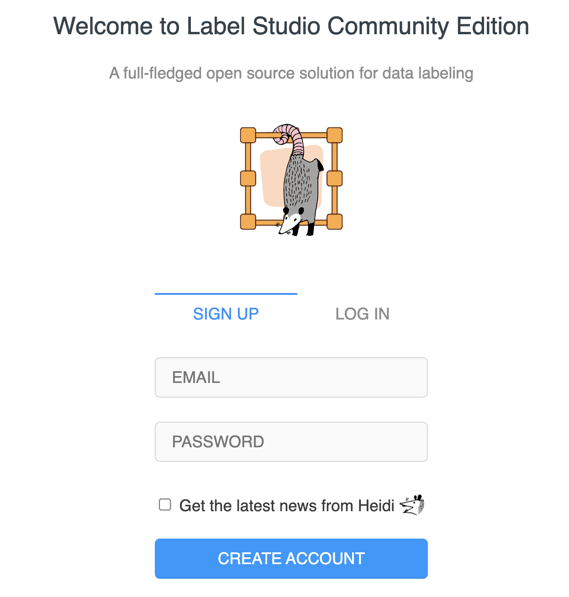
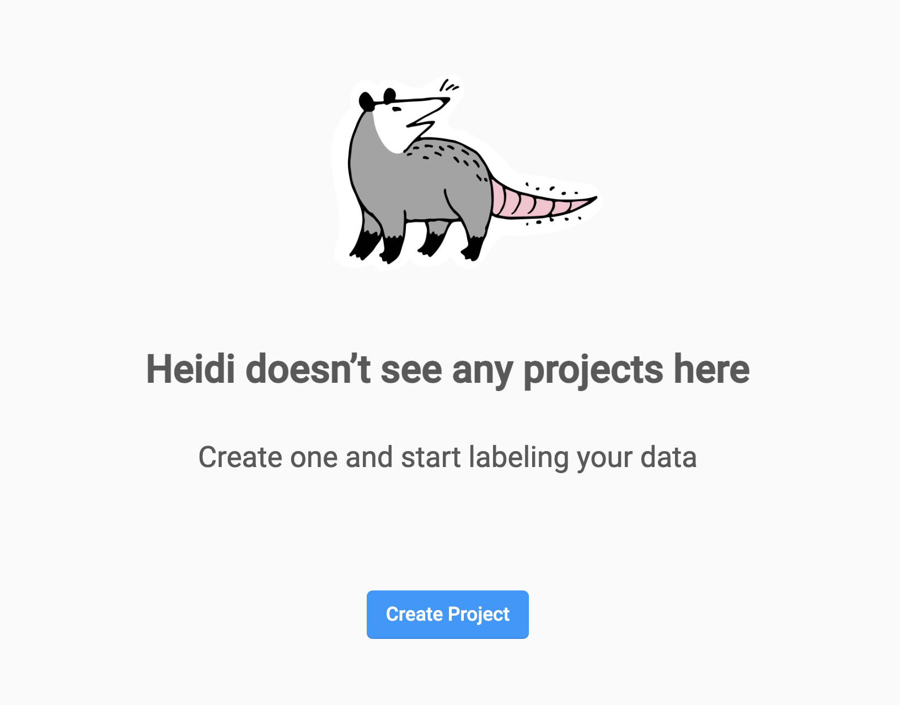
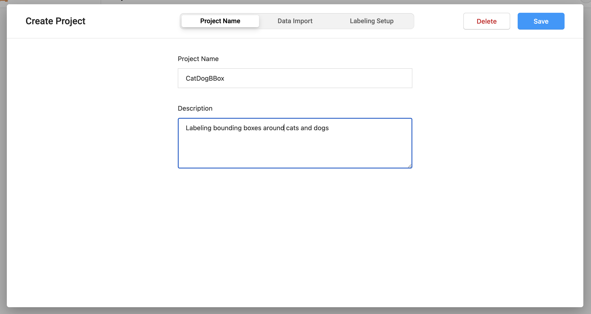
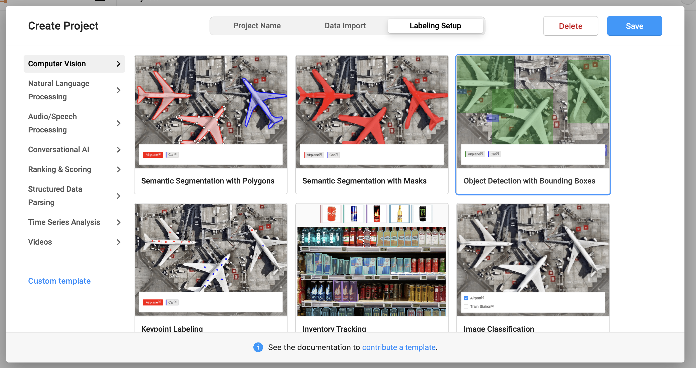
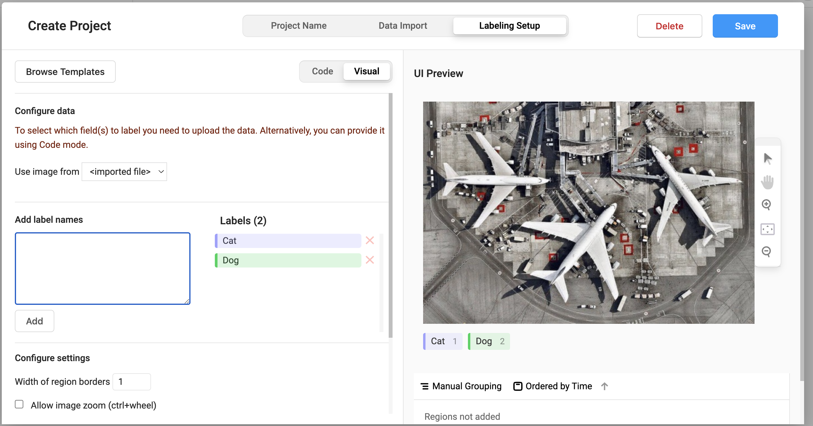
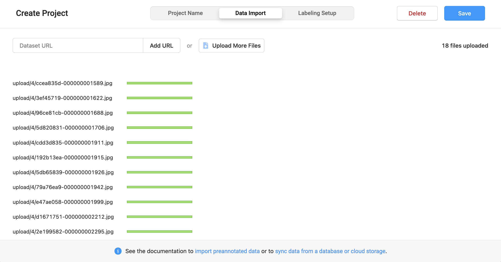
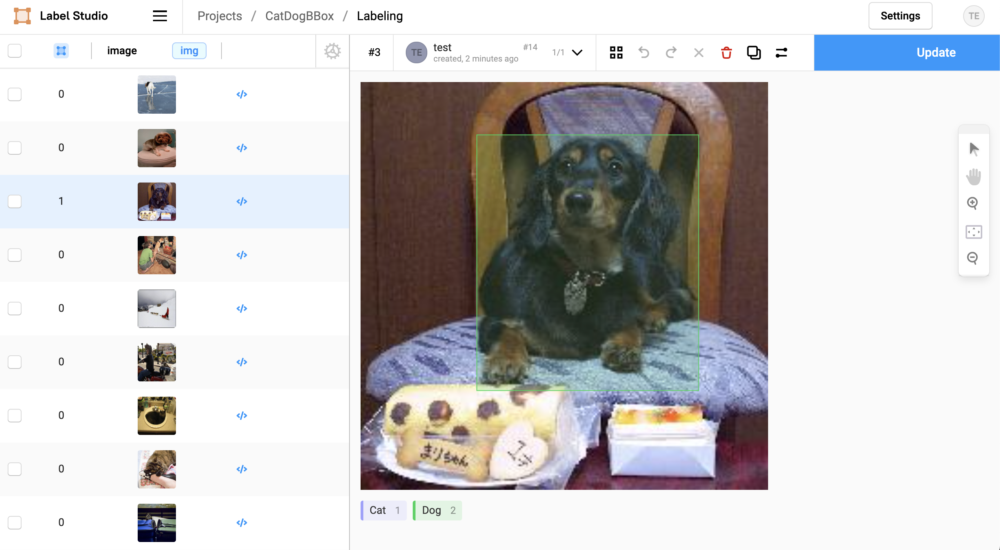
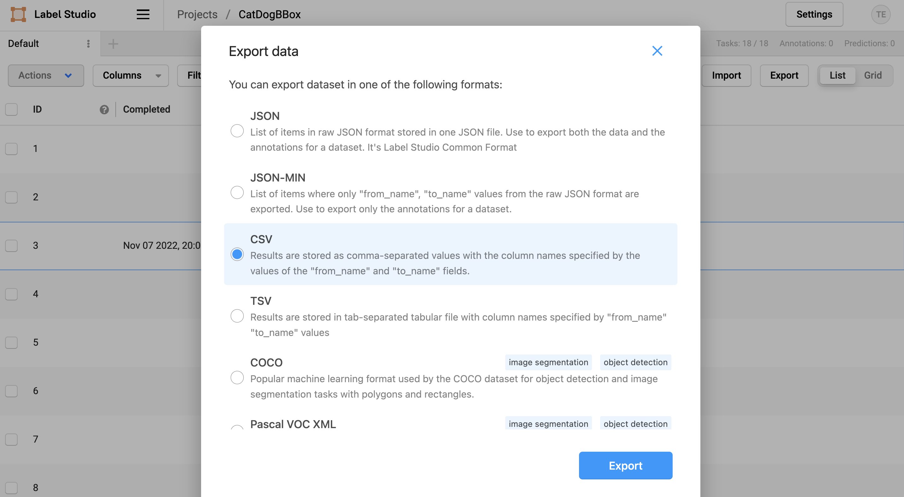

# Label Studio Integration

Label Studio is a popular Open Source data labeling tool that anyone can build custom UIs or use pre-built labeling templates.

For this example we will be labeling bounding boxes around Cats and Dogs.

## Installation

You can find more ways to install Label Studio in their [Documentation](https://github.com/heartexlabs/label-studio). For now we will just use `pip`.

```bash
$ pip install label-studio
```

## Run

To run Label Studio and have it save off the images to a specified directory you pass the `--data-dir` flag

```bash
$ label-studio start --data-dir label-studio/uploads/
```

## Login

Create a profile for the annotator you would like to annotate the initial images with. Label Studio is nice because you can have multiple accounts annotate the same data and cross validate their work.



## Setup Project

Next create a project



Name it CatDogBBox and give it an optional description



Pick the annotation task to be "Object Detection"



Create the labels to be "Cat" and "Dog"



## Annotate Data

Upload your images



Click on the label then drag a bounding box around the dog or cat (or both) in the photos



Once you are done with the first couple of annotations, export the annotations as a csv file. Instead of using the suggested file name with the convoluted timestamp, simply export a file called `annotations.csv` within the same directory you specified as the `--data-dir` when starting Label Studio.



## Track in Oxen

With a couple examples uploaded, annotated, and exported now would be a good time to setup the initial version control.

Open your terminal and navigate into the directory with all the data and initialize your Oxen repository.

```bash
$ oxen init
```

Then stage the initial annotations file as well as the uploads directory.

```bash
$ oxen add label-studio/annotations.csv
$ oxen add label-studio/uploads/media/upload/
$ oxen status
```


There are some other files in the `label-studio/uploads/` directory that we do not need to track right now including the sqlite database and an export directory.

Next commit the annotations file and the images.

```bash
$ oxen commit -m "Adding first couple annotations and images."
```

Now feel free to label a few more images and export to the same `label-studio/annotations.csv` file.

If you run `oxen status` again you will see it detects the changes.

```bash
$ oxen status

On branch main -> 61e672a9a88e4dcb

Modified files:    (use "oxen add <file>..." to update what will be committed)
  modified: label-studio/annotations.csv
```

Then you can run `oxen diff` on the file to see the annotations that were added since the last commit.

```bash
$ oxen diff label_studio/annotations.csv

Added Rows

shape: (3, 8)
┌──────────────┬─────┬──────────────┬───────────┬────────────┬─────────────┬─────────────┬───────────┐
│ image        ┆ id  ┆ label        ┆ annotator ┆ annotation ┆ created_at  ┆ updated_at  ┆ lead_time │
│ ---          ┆ --- ┆ ---          ┆ ---       ┆ _id        ┆ ---         ┆ ---         ┆ ---       │
│ str          ┆ i64 ┆ str          ┆ i64       ┆ ---        ┆ str         ┆ str         ┆ f64       │
│              ┆     ┆              ┆           ┆ i64        ┆             ┆             ┆           │
╞══════════════╪═════╪══════════════╪═══════════╪════════════╪═════════════╪═════════════╪═══════════╡
│ /data/upload ┆ 7   ┆ [{"x": 25.68 ┆ 1         ┆ 7          ┆ 2022-11-08T ┆ 2022-11-08T ┆ 5.906     │
│ /1/49e2dae1- ┆     ┆ 421052631579 ┆           ┆            ┆ 04:42:04.85 ┆ 04:42:04.85 ┆           │
│ 00000000...  ┆     ┆ , "y": 2...  ┆           ┆            ┆ 2993Z       ┆ 3035Z       ┆           │
├╌╌╌╌╌╌╌╌╌╌╌╌╌╌┼╌╌╌╌╌┼╌╌╌╌╌╌╌╌╌╌╌╌╌╌┼╌╌╌╌╌╌╌╌╌╌╌┼╌╌╌╌╌╌╌╌╌╌╌╌┼╌╌╌╌╌╌╌╌╌╌╌╌╌┼╌╌╌╌╌╌╌╌╌╌╌╌╌┼╌╌╌╌╌╌╌╌╌╌╌┤
│ /data/upload ┆ 5   ┆ [{"x": 19.36 ┆ 1         ┆ 5          ┆ 2022-11-08T ┆ 2022-11-08T ┆ 7.166     │
│ /1/9cede6c3- ┆     ┆ 842105263158 ┆           ┆            ┆ 04:41:33.50 ┆ 04:41:33.50 ┆           │
│ 00000000...  ┆     ┆ , "y": 2...  ┆           ┆            ┆ 5882Z       ┆ 5921Z       ┆           │
├╌╌╌╌╌╌╌╌╌╌╌╌╌╌┼╌╌╌╌╌┼╌╌╌╌╌╌╌╌╌╌╌╌╌╌┼╌╌╌╌╌╌╌╌╌╌╌┼╌╌╌╌╌╌╌╌╌╌╌╌┼╌╌╌╌╌╌╌╌╌╌╌╌╌┼╌╌╌╌╌╌╌╌╌╌╌╌╌┼╌╌╌╌╌╌╌╌╌╌╌┤
│ /data/upload ┆ 6   ┆ [{"x": 9.894 ┆ 1         ┆ 6          ┆ 2022-11-08T ┆ 2022-11-08T ┆ 11.478    │
│ /1/2eeef79e- ┆     ┆ 736815053673 ┆           ┆            ┆ 04:41:54.20 ┆ 04:41:54.20 ┆           │
│ 00000000...  ┆     ┆ , "y": 9...  ┆           ┆            ┆ 9253Z       ┆ 9292Z       ┆           │
└──────────────┴─────┴──────────────┴───────────┴────────────┴─────────────┴─────────────┴───────────┘
```
